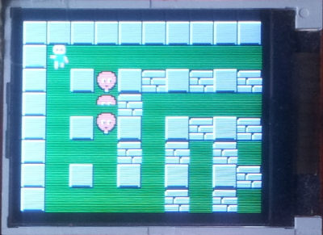
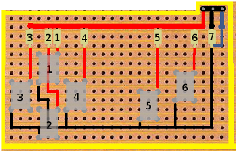
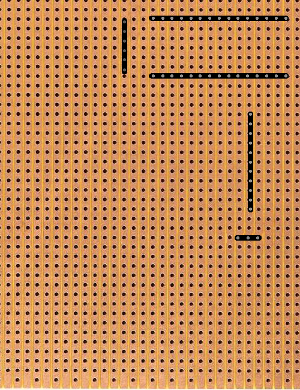
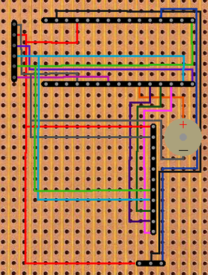
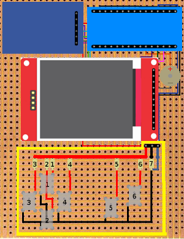

# Arduino Nano handheld game console

This is Nanoboy Basic, an Arduino Nano based handheld game console.

The repository contains 2 sketches:

* Sokoban like game - remake of the game "Move the box" from the old Siemens A55
* Bomberman - basic version of the NES game "Bomberman"

    

## Getting Started

### Prerequisites

* Arduino Nano
* 1.8 in Display (160x128)
* MicrodSD / SD card socket
* Buzzer
* 6 Momentary switches
* Resistors: one of each : 220, 390, 680, 1k, 2.2k, 4.7k, 10k ohms
* male and female header pin strips
* some short cables
* test board

### Build

* **Gamepad**

    First lets make a game controller.
For more details check this [link](http://forum.arduino.cc/index.php?topic=8558.0). 
We need a piece of test board to solder the buttons and the resistors like this:  
 
The gray boxes are the buttons. 
The gold ones are the resistors:

  * 1 - 220 ohms
  * 2 - 390 ohms
  * 3 - 680 ohms
  * 4 - 1k ohm
  * 5 - 2.2k ohms
  * 6 - 4.7k ohms
  * 7 - 10k ohms

  Red wire is connected to Arduino’s 5V pin, black to GND and blue to A0. 
When the circuit is closed we read the value at pin A0.  Value ranges:

  * 1 = [837, 838] 
  * 2 = [733, 736] 
  * 3 = [609, 610] 
  * 4 = [316, 318] 
  * 5 = [174, 178] 
  * 6 = [89, 91] 
  * 3 + 4 = [671, 674]

* **Main board**

    Solder the female header pins like this: 
 
We need to connect the pins as following: 

| **Lcd** | **Arduino** |
| --- | --- |
| VCC | 5V |
| GND | GND |
| CLK/SCK | D13 |
| SDA | D11 |
| RS/DC | D9 |
| RST | D8 |
| CS | D10 |
|**SD Card** ||
|CS | D4 |
|MOSI | D11 |
|CLK | D13 |
|MISO | D12 |
|**Buzzer** ||
|+ | D7 |
|- | GND|

Finished mainboard: 

### Dependencies

For the lcd to work we need a couple of libraries:

* [Adafruit_GFX.h](https://github.com/adafruit/Adafruit-GFX-Library)
* [Adafruit_ST7735.h](https://github.com/adafruit/Adafruit-ST7735-Library)

### Usage

Open the sketch you want with Arduino IDE and upload it.

## Authors

* **Alexandru Scutaru** -  [AlexandruScutaru](https://github.com/AlexandruScutaru)

## Credits

* [BLACK SQUIRREL](https://www.spriters-resource.com/nes/bomberman/sheet/7884/) - Bomberman sprites.

## License

This project is licensed under the MIT License - see the [LICENSE.md](LICENSE.md) file for details
